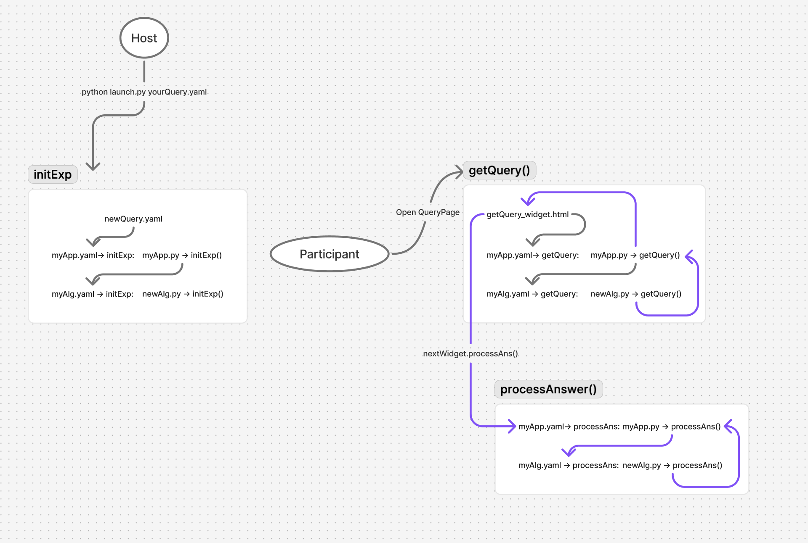
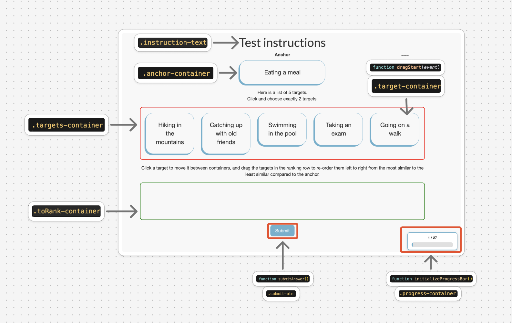

# NEXT Development Documentation

## Creating a New Query: Step-by-Step Guide

This guide explains how to create a new query called `newQuery` from scratch, following the hierarchical structure of the NEXT framework. 

### 🎯 **Developer Preparation Requirements**

**Before starting development, you MUST prepare:**
0. **User Documentation & Experience**:
   - Complete the user documentation tutorials
   - Successfully run 2-3 example experiments
   - Understand the basic workflow of creating and managing experiments
   - Familiarize yourself with the participant experience
   - Be comfortable with the web interface and dashboard

1. **Working UI Design**: Have a complete, tested UI design in Javascript for your query interface. This includes:
   - Wireframes or mockups of the user interface
   - User interaction flow and state management
   - Responsive design considerations
   - Accessibility requirements

2. **Algorithm Design** (if implementing active learning):
   - Define your active learning strategy
   - Specify how queries will be generated based on participant responses
   - Design the model update mechanism
   - Plan the convergence criteria

3. **Resource Requirements**:
   - Identify any media files (images, audio, video) your query will use
   - Plan for file storage and delivery mechanisms
   - Consider memory and processing constraints

**⚠️ Critical Note**: The NEXT framework is designed for rapid experimentation. If you don't have a clear UI design and algorithm strategy, you will waste significant time during development.

### Overview

The NEXT framework follows a hierarchical structure where data flows between endpoints in JSON format. Creating a new query involves establishing these endpoints to create a streamlined process that:

1. Initializes the experiment by storing essential parameters
2. Generates queries dynamically for each participant
3. Renders the user interface for participants to interact with
4. Collects and processes participant responses

This endpoint-based architecture enables smooth data flow and experiment management throughout the query lifecycle. To facilitate your task, I will break down the work flow into levels and more specispecficallyfically, files, that you would necessarily have to edit/rewrite:
1. **Template Level**: A YAML file that contains experiment-related flags and parameters ([Step 1](#step-1-create-the-template-configuration))
2. **App Level**: A YAML file that decides what arguments get passed into/return from which function in the following python file  -> A python file that fetches, processes those arguments and passes them onto a deeper, algo-level handler ([Step 2](#step-2-create-app-configuration--implementation))
3. **Algorithm Level**: A YAML file that decides what arguments get passed into/return from which function in the following python file -> A python file that runs your algorithm to generate the actual query ([Step 3](#step-3-create-algorithm-configuration--implementation))
4. **Widget Level**: A HTML file that renders the query interface based on the result generated from you algorithm ([Step 4](#step-4-create-the-widget-interface))


The following sections will provide concrete example for the above illustration. In most cases, since the YAML file defines the parameters that get passed to the corresponding functions in the Python files, **it's crucial that these align properly.** 

### 🚨 **Important Legacy Notes**

Before starting development, please note these critical system constraints and best practices:

#### **Docker Storage Management**
- **Docker storage can overflow during development** - run `docker system prune` regularly to clear build cache
- Monitor Docker disk usage: `docker system df`
- If you see storage issues, run: `docker system prune -a --volumes`

#### **Memory Constraints**
- **Each Celery worker has ~5GB free memory** for task processing
- **Query processing tasks must stay within memory limits** or the server will crash
- **Avoid processing large video/audio files** in `getQuery` tasks
- **Stick to maximum image processing** for query generation

#### **Resource Handling Strategy**
- **For video/audio**: Store pre-generated resources on file storage and map to targetset
- **Frontend rendering**: Let the frontend handle video/audio rendering from stored resources
- **Backend extension**: Consider extending backend logic to write generated media to file storage
- **Example**: PAQ implementation had issues with video generation during query processing

#### **Reference Existing Implementations**
- **Study existing apps** like `ARankB`, `PAQ`, `DynamicPAQ` under `apps/` directory
- **Copy and modify** existing widget templates and algorithm patterns
- **Maintain consistency** with the existing system architecture

---

## Step 1: Create the Template Configuration

### 1.1 Create `newQuery.yaml`

Start by creating a new template file `newQuery.yaml` that extends the base configuration and defines your experiment-specific parameters:

```yaml
# Just like a dictionary, throw in your parameters in the form of key-val pair
app_id: newQuery
args:
  alg_list:
    - {alg_id: newAlgo, alg_label: newAlgo_1, test_alg_label: test}
  algorithm_management_settings:
    mode: fixed_proportions
    params:
    - {alg_label: newAlgo, proportion: 1}
  num_tries: 100
  #--------Create args related to your exp--------------------------------#
  your_arg_1: 25
  your_flag_1: true
  #-----------------------------------------------------------------------#
  debrief: Test debrief 
  instructions: Drag the slider until the color on the right matches the color on the left. 
  participant_to_algorithm_management: one_to_many
  # Where you store your resources. You can access them in app level when you see an object called target_manager. Don't have to use them tho.
  targets:
    targetset: 
    - {primary_description: '0', alt_description: '#0047AB', primary_type: 'color', alt_type: ''}
    - {primary_description: '1', alt_description: '#DC143C', primary_type: 'color', alt_type: ''}
    - {primary_description: '2', alt_description: '#438AD2', primary_type: 'color', alt_type: ''}
    - {primary_description: '3', alt_description: '#ED751E', primary_type: 'color', alt_type: ''}
    - {primary_description: '4', alt_description: '#87CEFA', primary_type: 'color', alt_type: ''}
    - {primary_description: '5', alt_description: '#FFD700', primary_type: 'color', alt_type: ''}
```

### 1.2 Understanding YAML Structure

**Key-Value Pairs Under `args`**: These define the parameters that are passed into the corresponding Python function. For example, under `getQuery: args:`, all parameters listed will be passed to the `getQuery()` function.

**Key-Value Pairs Under `rets`**: These define the expected return structure from the Python function.

**Important Keywords**:
- `optional: true` - Parameter is not required
- `type: any` - Parameter can be any data type
- `type: list` - Parameter is a list; use `values:` to specify the type of list elements
- `type: dict` - Parameter is a dictionary; use `values:` to specify the structure
- `type: oneof` - Parameter can be one of several types; use `values:` to specify options

**Example of List Type Specification**:
```yaml
my_list:
  type: list
  values:
    type: str  # Each element in the list is a string
```

**Example of Dict Type Specification**:
```yaml
my_dict:
  type: dict
  values:
    key1:
      type: str
    key2:
      type: num
      optional: true
```

---

## Step 2: Create the App Structure

### 2.1 Create Directory Structure

Copy and paste any query folder inside `/home/ubuntu/NEXT/apps`. Rename it to  `newQuery`.

### 2.2 Edit `apps/NewQuery/myApp.yaml`

This file defines the app-specific parameters that will be passed to the corresponding functions, `initExp`, `getQuery`, `processAnswer` in your `myApp.py`:

```yaml
extends: [base.yaml]

initExp:
  args:
    app_id:
      values: [NewQuery]
    args:
      values:
        alg_list:
          values:
            values:
              alg_id:
                description: Supported algorithm types for NewQuery
                values: [NewAlgo]
        
        # Your app-specific parameters
        custom_parameter_1:
          description: App-level custom parameter
          type: str
        
        custom_parameter_2:
          description: Another app-level parameter
          type: num
        
        # Standard parameters
        instructions:
          default: "Your custom instructions here"
          optional: true
        
        num_tries:
          default: 25
          optional: true

getQuery:
  args:
    args:
      values:
        participant_uid:
          type: str
          optional: true
        widget:
          type: boolean
          default: false

processAnswer:
  args:
    args:
      values:
        query_uid:
          type: str
        answer:
          description: The participant's response
          type: any
        response_time:
          type: num
          optional: true
```

### 2.3 Edit `apps/NewQuery/myApp.py`

This is the main application logic that handles experiment initialization, query generation, and answer processing. Notice how it is one level above algs. Therefore, it must call its algo-level counterpart by using ```alg()```(see under ```getQuery()```). In fact, NEXT backend needs to calculate performance metrics by tracking time lasted during running ```alg()```. So even if you are doing anything at alg-level, e.g. a dummy algorithm, make sure you call it to avoid backend exception. Additionally, function inside `myApp.py` should only complete tasks that are indifferent to algorithm types, e.g. fetching a specific argument (see under `initExp`), or grabbing the corresponding targets from targetset based on the value returned by calling ```alg()```.

```python
import json
import next.utils as utils
import next.apps.SimpleTargetManager

class MyApp:
    def __init__(self, db):
        self.app_id = 'NewQuery'
        self.TargetManager = next.apps.SimpleTargetManager.SimpleTargetManager(db)

    def initExp(self, butler, init_algs, args):
        """
        Initialize the experiment.
        
        This function is called once when the experiment is created. It sets up:
        - Target management (loading targets from targetset or generating n targets)
        - Algorithm initialization with experiment parameters
        - Experiment-wide configuration
        
        Args:
            butler: Butler object for data management and storage
            init_algs: Function to initialize algorithms with parameters
            args: Arguments from myApp.yaml containing experiment configuration
        """
        exp_uid = butler.exp_uid
        
        # Handle targets
        if 'targetset' in list(args['targets'].keys()):
            n = len(args['targets']['targetset'])
            self.TargetManager.set_targetset(exp_uid, args['targets']['targetset'])
        else:
            n = args['targets']['n']
        
        args['n'] = n
        del args['targets']

        # Prepare algorithm data - extract parameters that should go to algorithms
        alg_data = {}
        algorithm_keys = ['custom_parameter_1', 'custom_parameter_2']  # Add your parameters here
        
        for key in algorithm_keys:
            if key in args:
                alg_data[key] = args[key]

        # Initialize algorithms with the prepared data
        init_algs(alg_data)
        return args

    def getQuery(self, butler, alg, args):
        """
        Generate a query for the participant.
        
        This function is called each time a participant requests a new query. It:
        - Tracks participant progress (query count)
        - Calls the algorithm to generate the query
        - Returns the query data to be rendered by the widget
        
        Args:
            butler: Butler object for data management and storage
            alg: Algorithm instance that implements the query generation logic
            args: Arguments from getQuery request (participant_uid, widget, etc.)
        """
        participant_uid = args.get('participant_uid', butler.exp_uid)
        
        # Track participant's query count using butler.participants
        if not butler.participants.exists(uid=participant_uid, key='query_id'):
            butler.participants.set(uid=participant_uid, key='query_id', value=0)
        
        query_id = butler.participants.get(uid=participant_uid, key='query_id')
        
        # Get experiment data
        exp_uid = butler.exp_uid
        experiment = butler.experiment.get()
        
        # Prepare data for algorithm
        alg_args = {
            'query_id': query_id,
            'participant_uid': participant_uid,
            # Add any other data your algorithm needs
        }
        
        # Call algorithm to generate query
        alg_response = alg(alg_args)
        
        # Increment participant's query count
        butler.participants.increment(uid=participant_uid, key='query_id')
        
        return alg_response

    def processAnswer(self, butler, alg, args):
        """
        Process the participant's answer.
        
        This function is called when a participant submits an answer. It:
        - Records the answer and response time
        - Updates experiment statistics
        - Calls the algorithm to process the answer (for active learning)
        
        Args:
            butler: Butler object for data management and storage
            alg: Algorithm instance that implements answer processing logic
            args: Arguments from processAnswer request (query_uid, answer, response_time)
        """
        query = butler.queries.get(uid=args['query_uid'])
        experiment = butler.experiment.get()
        
        # Track number of answers
        num_reported_answers = butler.experiment.increment(
            key='num_reported_answers_for_' + query['alg_label'])

        # Process answer with algorithm
        alg({'answer': args['answer']})
        
        return {'answer': args['answer']}

    def getModel(self, butler, alg, args):
        """
        Get the current model state.
        
        This function is called to retrieve the current state of the algorithm/model.
        Useful for:
        - Monitoring experiment progress
        - Debugging algorithm behavior
        - Analyzing model convergence
        
        Args:
            butler: Butler object for data management and storage
            alg: Algorithm instance
            args: Arguments from getModel request
        """
        return alg()

    def format_responses(self, responses):
        """
        Format responses for display.
        
        This function is called to format raw response data for display in the
        experiment dashboard or analysis tools.
        
        Args:
            responses: Raw response data from the experiment
        """
        return [responses]
```

### 2.4 Understanding the Butler System

The **Butler** is a data management system that provides persistent storage for your experiment. It has several storage areas:

**`butler.algorithms`**: Store algorithm-specific data that persists across queries
```python
# Store algorithm parameters
butler.algorithms.set(key='custom_parameter_1', value='some_value')

# Retrieve stored data
value = butler.algorithms.get(key='custom_parameter_1')

# Store complex data structures
butler.algorithms.set(key='model_state', value={'weights': [1, 2, 3], 'bias': 0.5})
```

**`butler.participants`**: Store participant-specific data
```python
# Store participant progress
butler.participants.set(uid=participant_uid, key='query_id', value=0)

# Increment counters
butler.participants.increment(uid=participant_uid, key='query_id')

# Check if data exists
if butler.participants.exists(uid=participant_uid, key='query_id'):
    # Do something
```

**`butler.experiment`**: Store experiment-wide data
```python
# Get experiment configuration
experiment = butler.experiment.get()

# Increment experiment counters
butler.experiment.increment(key='total_answers')
```

**`butler.queries`**: Store query-specific data
```python
# Store query data
butler.queries.set(uid=query_uid, key='query_data', value=query_dict)

# Retrieve query data
query = butler.queries.get(uid=query_uid)
```
---

## Step 3: Create Algorithm Configuration & Implementation

### 3.1 Edit `apps/NewQuery/algs/Algs.yaml`

Similarly, this file defines the parameters that will be passed to your algorithm's Python functions:

```yaml
initExp:
  args:
    custom_parameter_1:
      description: Algorithm-specific parameter 1
      type: str
      optional: true
    custom_parameter_2:
      description: Algorithm-specific parameter 2
      type: num
      optional: true
  rets:
    type: bool
    description: Success indicator
    values: true

getQuery:
  args:
    query_id:
      description: Current query identifier
      type: num
    participant_uid:
      description: Participant identifier
      type: str
  rets:
    description: The query dictionary
    type: dict
    values:
      query_data:
        description: The main query data
        type: any
      metadata:
        description: Additional query metadata
        type: dict
        optional: true

processAnswer:
  args:
    answer:
      description: The participant's answer
      type: any
  rets:
    type: bool
    description: Success indicator
    values: true

getModel:
  rets:
    type: dict
    description: Current model state
    values:
      num_reported_answers:
        description: Number of answers processed
        type: num
      model_state:
        description: Current model state
        type: any
        optional: true
```

### 3.2 Edit `apps/NewQuery/algs/NewAlgo/myAlg.py`

This is where your core algorithm logic lives. Import any dependencies on the top of the file. Make sure to add new library under pip install at `/home/ubuntu/NEXT/next/base_docker_image/requirements.txt` so that you rebuild docker, these dependencies get installed.

```python
import numpy as np
import json
import next.utils as utils

class MyAlg:
    def initExp(self, butler, custom_parameter_1=None, custom_parameter_2=None):
        """
        Initialize the algorithm.
        
        This function is called once when the experiment is created. Use it to:
        - Store algorithm parameters in butler.algorithms
        - Initialize algorithm state
        - Set up any data structures needed for query generation
        
        Args:
            butler: Butler object for data management
            custom_parameter_1: Your first custom parameter
            custom_parameter_2: Your second custom parameter
        """
        # Store parameters in algorithm storage
        butler.algorithms.set(key='custom_parameter_1', value=custom_parameter_1)
        butler.algorithms.set(key='custom_parameter_2', value=custom_parameter_2)
        butler.algorithms.set(key='num_reported_answers', value=0)
        
        # Initialize any other algorithm state
        butler.algorithms.set(key='algorithm_state', value={})
        
        return True

    def getQuery(self, butler, query_id, participant_uid):
        """
        Generate a query for the participant.
        
        This is where your core algorithm logic lives. For active learning:
        - Use participant responses to determine the next best query
        - Implement your query selection strategy
        - Generate query data that will be rendered by the widget
        
        Args:
            butler: Butler object for data management
            query_id: Current query identifier
            participant_uid: Participant identifier
        """
        # Get stored parameters
        custom_param_1 = butler.algorithms.get(key='custom_parameter_1')
        custom_param_2 = butler.algorithms.get(key='custom_parameter_2')
        
        # Your query generation logic here
        # This is where you implement your specific algorithm
        
        # Example: Generate a simple query
        query_data = {
            'question': f"Query {query_id} for participant {participant_uid}",
            'options': ['Option A', 'Option B', 'Option C'],
            'custom_param': custom_param_1
        }
        
        metadata = {
            'query_id': query_id,
            'participant_uid': participant_uid,
            'timestamp': utils.datetimeNow()
        }
        
        return {
            'query_data': query_data,
            'metadata': metadata
        }

    def processAnswer(self, butler, answer):
        """
        Process the participant's answer.
        
        This function is called after each answer submission. For active learning:
        - Update your model based on the answer
        - Store the answer for future query generation
        - Update algorithm state
        
        Args:
            butler: Butler object for data management
            answer: The participant's answer
        """
        # Increment answer counter
        current_count = butler.algorithms.get(key='num_reported_answers')
        butler.algorithms.set(key='num_reported_answers', value=current_count + 1)
        
        # Your answer processing logic here
        # Update algorithm state based on the answer
        
        algorithm_state = butler.algorithms.get(key='algorithm_state')
        algorithm_state[f'answer_{current_count}'] = answer
        butler.algorithms.set(key='algorithm_state', value=algorithm_state)
        
        return True

    # Not essential but useful. Tells you when to report.
    def getModel(self, butler):
        """
        Get the current model state.
        
        This function returns the current state of your algorithm/model.
        Useful for:
        - Debugging algorithm behavior
        - Monitoring convergence
        - Analyzing experiment progress
        
        Args:
            butler: Butler object for data management
        """
        num_answers = butler.algorithms.get(key='num_reported_answers')
        algorithm_state = butler.algorithms.get(key='algorithm_state')
        
        return {
            'num_reported_answers': num_answers,
            'model_state': algorithm_state
        }
```

---

## Step 4: Create the Widget Interface

### 4.1 Edit `apps/NewQuery/widgets/getQuery_widget.html`

This is the final step where you integrate the user interface that renders your query. It should be standard a HTML, CSS, Javascript all in one Jinja 2 template.To better explain how it would look like, an UI rendered by `apps/ARankB/widgets/getQuery.html` is attached below.  Note that you do not have to understand the entire functionality of this particular file as your query will more than likely look and work very differently from it. The goal is to give you a big picture.

**⚠️ Key Takeaway**: 
1. Your UI is inserted into a larger frame created by `next/query_page`. When your implementation fails, the `widget_failure()` function in `next_widget.js` will be triggered, showing a pre-coded debrief screen. Study `next_widget.js` to understand the integration points and error handling.
2.  To access an argument within the dictionary returned from `getQuery()` that you wrote at app level, use `{{query.your_arg]}}`.
3. In your `submit()` function, make sure to call `next_widget.processAnswer(participant_response)`.
---

## Step 5: Testing Your Implementation

### 5.1 Start an Experiment

1. **Launch the experiment** using your `newQuery.yaml` template:
   ```bash
   cd examples/
   python launch.py path/to/newQuery.yaml 
   ```

2. **Access the experiment** through the web interface at the provided URL.

### 5.2 Debugging and Error Handling

**All errors are displayed in the web interface:**

1. Go to your experiment page
2. Click on **"Backend Exceptions"** to view any errors
3. The error messages will show exactly what went wrong and where

**Common debugging steps:**

1. **Check YAML alignment**: Ensure parameters in YAML files match function signatures in Python files
2. **Verify imports**: Make sure all `__init__.py` files are created
3. **Check parameter types**: Ensure data types match between YAML and Python
4. **Review butler usage**: Verify correct usage of the butler object for data storage/retrieval
5. **Widget debugging**: Check browser console for JavaScript errors
6. **Memory monitoring**: Monitor memory usage during query processing

**Example error debugging:**
- If you see "Parameter 'custom_parameter_1' not found", check that it's defined in both `myApp.yaml` and `Algs.yaml`
- If you see "TypeError in getQuery", verify that the function signature matches the parameters defined in `Algs.yaml`
- If you see memory issues, check that your query processing stays within the 5GB limit

### 5.3 Memory Management and Video Processing

**⚠️ Critical Memory Context**: During development of a video PAQ implementation, processing even a 3-second video consumed excessive memory, causing the entire instance to become unresponsive, including SSH access. This demonstrates the severe memory constraints of the system.

**Memory Management Best Practices**:
1. **Stay within 5GB limit** per Celery worker
2. **Avoid video/audio processing** during query generation
3. **Use file storage** for large media resources
4. **Let frontend handle rendering** of media files

**Future Solution for Video Processing**:
For any active learning query involving video generation, the **only viable solution** is to:

1. **Pre-generate all videos** before query time
2. **Write videos to file storage** on the instance
3. **Compress videos** (compressed videos take very little storage)
4. **Rewrite backend application** to support file writing to the instance
5. **Map pre-generated videos** to target sets

This approach ensures that query generation remains fast and memory-efficient while still supporting video-based experiments.

---

## Step 6: Using stress_test.py

The `stress_test.py` file is located in the `local/` directory and is used for load testing your experiments.

### 6.1 Configuration

Edit `local/stress_test.py` to configure your test:

```python
# Number of simulated users
instance_count = 50  # Up to 100

# Your experiment URL (replace with your actual URL)
query_url = 'http://your-server/query/query_page/query_page/your-experiment-id'

# Number of queries per user
n = 1000  # Up to 1000

# Number of targets in each query
num_targets_in_query = 100  # Up to 100
```

### 6.2 Running the Stress Test

1. **Ensure Selenium is running** (if using remote WebDriver):
   ```bash
   # Start Selenium standalone server
   java -jar selenium-server-standalone.jar -port 4444
   ```

2. **Run the stress test**:
   ```bash
   cd local/
   python stress_test.py
   ```

### 6.3 What the Stress Test Does

The stress test:
- Creates multiple headless Chrome browser instances
- Simulates multiple users accessing your experiment simultaneously
- Performs random interactions with your query interface
- Measures performance under load
- Helps identify bottlenecks and scalability issues

### 6.4 Interpreting Results

- **Performance metrics**: Monitor response times and error rates
- **Resource usage**: Check CPU, memory, and database load
- **Error patterns**: Look for specific failure modes under load
- **Scalability**: Determine how many concurrent users your system can handle

---

## Parameter Alignment Checklist

Before testing, verify these alignments:

### ✅ Template → App Level
- `newQuery.yaml` parameters → `myApp.yaml` parameters
- `app_id` values match
- Required parameters are defined in both files

### ✅ App Level → Algorithm Level  
- `myApp.yaml` parameters → `Algs.yaml` parameters
- Function signatures in `myApp.py` match YAML definitions
- Algorithm keys are properly extracted and passed

### ✅ Algorithm Level → Implementation
- `Algs.yaml` parameters → `myAlg.py` function signatures
- Return types match expected formats
- Butler storage keys are consistent

### ✅ Widget Level → Algorithm Output
- Widget template variables match algorithm return structure
- Data types are compatible between backend and frontend
- Error handling is implemented in both layers

### ✅ Data Flow Verification
- Parameters flow correctly from YAML → Python functions
- Return values match expected structures
- Error handling is in place at each level
- Memory usage stays within 5GB limit per worker

---

## Best Practices

1. **Start Simple**: Begin with minimal parameters and add complexity gradually
2. **Test Incrementally**: Test each layer independently before integration
3. **Use Descriptive Names**: Make parameter and function names self-documenting
4. **Handle Errors Gracefully**: Implement proper error handling at each level
5. **Document Assumptions**: Comment your code to explain the expected data flow
6. **Version Control**: Use meaningful commit messages when making changes
7. **Memory Management**: Monitor memory usage and stay within 5GB limit per worker
8. **Docker Maintenance**: Run `docker system prune` regularly to prevent storage overflow
9. **Resource Strategy**: Store large media files and let frontend handle rendering
10. **Reference Existing Code**: Study and adapt patterns from existing apps like ARankB, PAQ

---

## Legacy System Notes

### **System Architecture**
- **Backend**: Maintains existing structure and implementation patterns
- **Frontend**: Widgets handle rendering and user interaction
- **Storage**: Butler system manages data persistence
- **Workers**: Celery workers handle task processing with memory constraints

### **Development Workflow**
1. **Study existing apps** (`ARankB`, `PAQ`, `DynamicPAQ`) for patterns
2. **Copy and modify** existing templates and implementations
3. **Maintain consistency** with the current system architecture
4. **Test thoroughly** to ensure compatibility with existing infrastructure

### **Performance Considerations**
- **Memory limits**: Each worker has ~5GB available memory
- **Processing constraints**: Avoid heavy computation in query generation
- **Storage strategy**: Use file storage for large media resources
- **Caching**: Leverage existing caching mechanisms where appropriate

This documentation provides a complete roadmap for creating new queries in the NEXT framework while respecting the existing system architecture and constraints. Follow each step carefully and ensure parameter alignment at every level. 