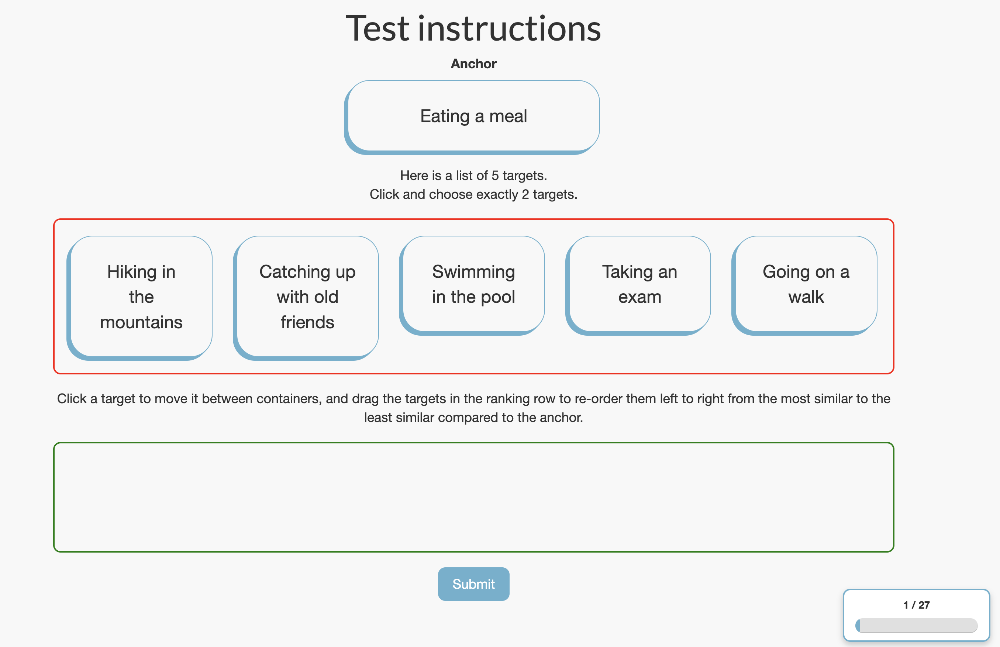
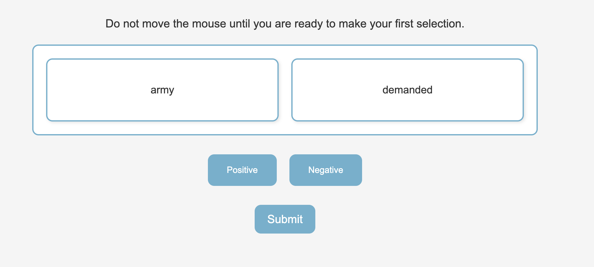
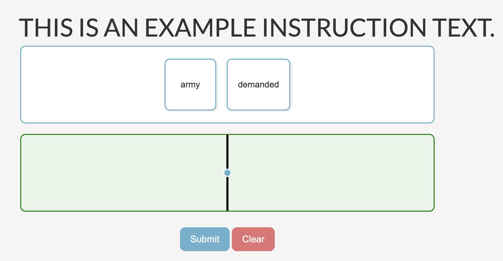
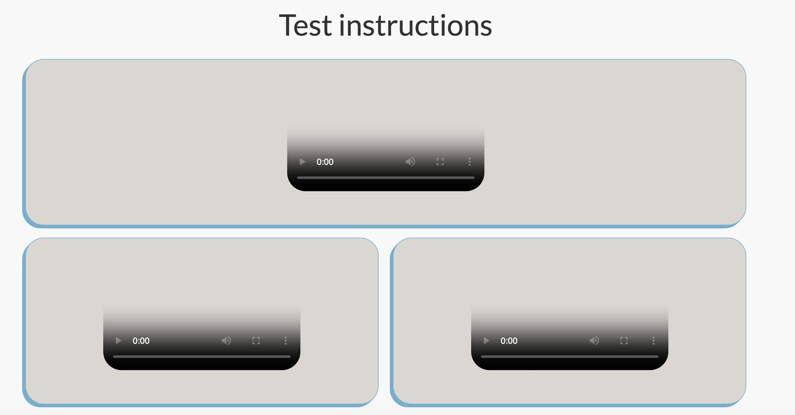
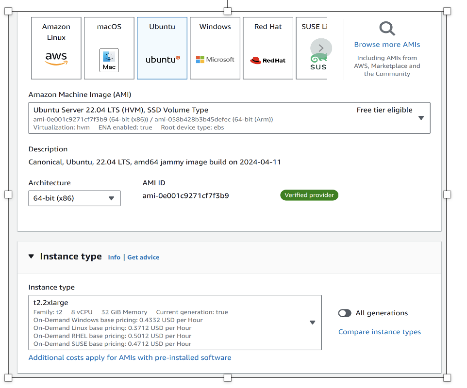
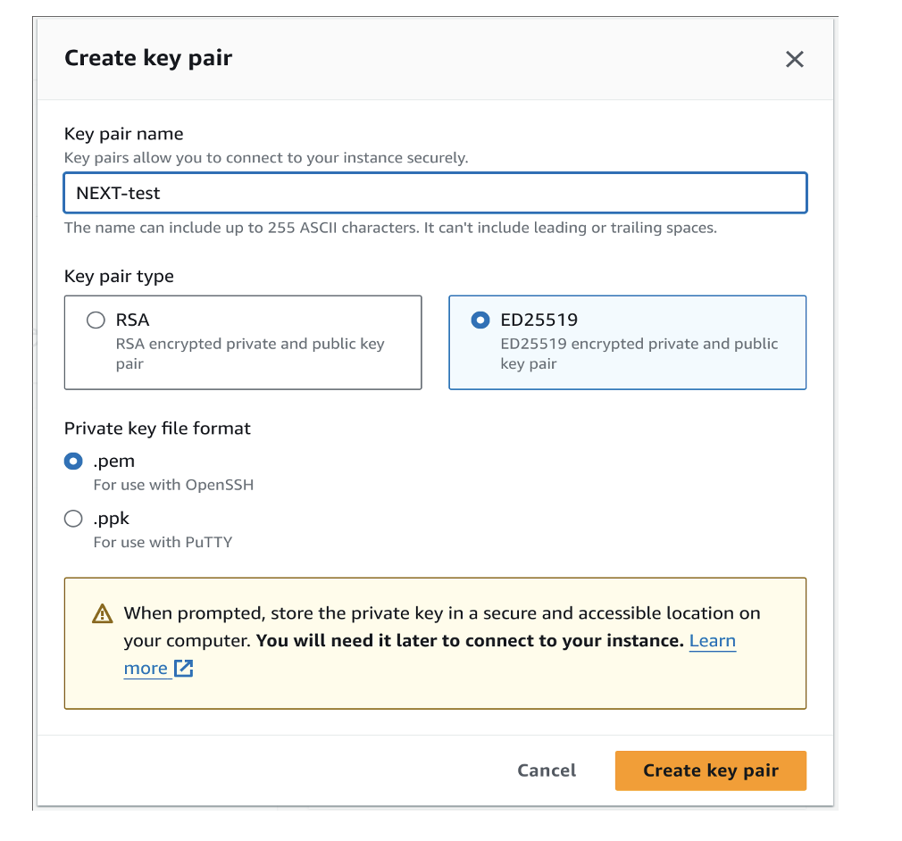
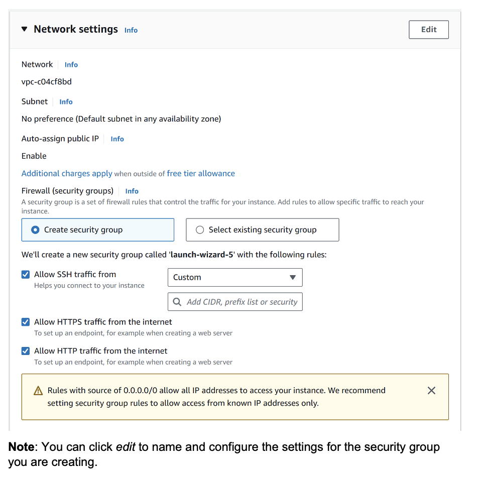
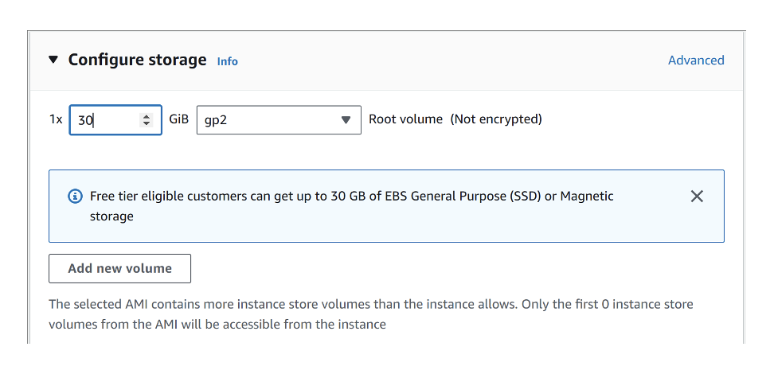

# NEXL ML Documentation


## 1. Experiment Overview
### 1.1. Introduction
- **Project Purpose:**  NEXL ML is a data collection platform designed to gather human feedback on a variety of query types. It enables users to conduct active learning experiments while tracking experimental data and other key metrics.
- **Scope:** This documentation outlines the available query types and their usage, including how to modify input parameters. It also provides guidance on deploying the application, starting and testing an experiment, and managing a running experiment by performing actions such as retiring or unretiring an experiment, and monitoring embedding calculations and server performance metrics.

### 1.2. Supported Query Types
## A Rank B 
- **Overview:** Given $A$ number of items, participants choose $B < A$ out and rank them based on some anchor item. 
- **Query Interface:** 
  - The red box displays the full pool of items. 
  - The green box is where the $B$ items that a participant intends to rank are placed.
  - Clicking on an item in the red box transfers it to the green box, while clicking on an item in the green box returns it to the red box.
  - To arrange the items, simply drag and drop them within the green box.
  - A participant can only submit their response when exactly $B$ items are in the green box.
- **Dynamic Sampling Algorithm:** 
  Each query is generated dynamically by some algorithm.
  - Random Sampling: Implements a basic approach by randomly selecting $A+1$ items from all user-provided targets.
    - Users can modify the input values for $A$, $B$, and the set of items to be ranked (see template ```NEXT/local/template/ArankB-init.yaml``` for all adjustable parameters).
  - Info-Tuple Sampling: Dynamically updates an embedding based on responses received in real time and selects the tuple of items expected to yield the highest information gain as the subsequent query.
    - In addition to the configurable options mentioned above, users can adjust a range of parameters unique to Info-Tuple Sampling, including the number of burn-in iterations, total iterations, down-sampling rate, and more (see template ```NEXT/local/template/ArankB-init.yaml``` for comprehensive configuration details and explanations for each parameter).


## Binary Sentiment Word Classification Rank One and Rank N
- **Overview:** Given $n$ words, participants needs to choose the most positive word(Rank One)/ rank from most positive to most negative(Rank N).
- **Query Interface for Rank One:**  
  - The central box displays the full pool of words. 
  - Clicking on a word will highlight it to indicate choice.
- **Query Interface for Rank N:**  
  - The central box displays the full pool of words. 
  - Clicking on an word will highlight it to indicate choice.
  - A participant can only submit their response when exactly one word is clicked.
- **Static Sampling Algorithm:** 
  - Read CSV: Given a CSV file where each row represents the content of one query. Truncate the first *number_of_queries* rows off and naively present them as query.
    - A specific way of implementing static sampling explained previously. 
   

## Pool Based Triplets(By Neuromatch)
- **Overview:** Given an item triplet. Participants need to choose one item out of two give an anchor.
- **Query Interface:**  
  - The top box displays the anchor item.
  - Clicking one of the item on the bottom to suggest preference. 
  - Next query will automatically load after clicking. 
- **Sampling Algorithm:** 
  - CrowdKernel 
  - RandomSampling
  - STE
  - UncertaintySampling
  - ValidationSampling
    - User can decide what algorithms to include with what proportion. Refer to  ```NEXT/local/PBS-init.yaml``` for more details.
### 1.3. Experiment Outcomes
- **Results Overview:** All experiment-related input, whether provided by the user or generated by the system, is accessible at all times. Additionally, data such as embeddings, participant counts, and received responses can be monitored continuously, although the update frequency may vary based on the algorithm.
- **Performance Metrics:** The performance metrics available to the user include an algorithmic timing plot for each type of request, which details how long the NEXT system took to respond to a sequence of requests, as well as a histogram that presents client-side or participant-side timing data, among other information.

---

## 2. Preparation
### 2.1. AWS Instance Setup
This section describes how to set up an AWS instance to host the NEXT ML platform. Instructions for how to run the system locally can be found in the README.md of the local directory in the NEXT github repository. We assume that you have an AWS account and are familiar with computer systems, linux, SSH and the terminal.
- **Instance Type** - We suggest at minimum using an instance type of t2.2xlarge to run the NEXT system. This may need to be increased depending on the scale of your experiments. It is a good idea to monitor system performance during the experiments. This will inform you about the resources needed and can help determine the optimal instance type. You should select ubuntu 22.04 LTS as your operating system. This operating system is stable and has been tested with the NEXT implementation.
 
- **Key Pair** -
In order to SSH into the system, you will need to use a pre-existing key pair that you have on AWS, or create a new one. We recommend creating a new one as a good security practice. Select create key pair and then do the following:
  - name it, i.e NEXT
  - use ed25519 (more secure)
  - select .pem as the file type and download the .pem
  - add the key file (i.e NEXT.pem) to your SSH key folder (i.e .ssh)
  - change the file permissions for the .pem file to allows access for your local user only 
    - ``` chmod 400 your_key.pem ```

 
- **Security Group** -
Since NEXT is a web facing application, you will need to create a security group to allow HTTP/HTTPS and SSH traffic to be routed to your instance. Otherwise, AWS will block requests to those standard ports. If you do not already have a group setup for this, you can create one while creating your instance. Simply:
  - allow HTTP traffic from all IP addresses
  - allow HTTPS traffic from all IP addresses
  - allow SSH traffic
    - You can restrict this traffic to be solely from your IP address (or list of addresses) to increase security of your instance.
 
- **Disk Space** -
To launch an AWS instance, you will need hard drive space. Select the amount of space you need. The maximum amount of free tier space should suffice for your needs. Once you finish experiments, you can always download the data and remove the Dockers and rebuild your Docker environment. This will clear old data.
 
### 2.2. Launch Instance  
Now you are ready to launch your instance. Simply click Launch instance. Wait for all the checks to pass and then you are ready to SSH into the system. Make sure to take note of the public dns address and the public ip under instance information. You will need them for SSH and nginx respectively.
Note: We have included a web server (nginx) into the Docker environment so that you do not need to set up the reverse proxy yourself. You will only need to add the ip address in the nginx.conf file before spinning up the dockers.
- **SSH** -
Once you have set up your instance (from scratch or from the AMI) and all checks have passed, you can now SSH into your system. All system configuration and experiment launching can be handled from the terminal. Make sure to use the ubuntu user and the .pem file as your identity file when SSHing in. The command will look something like this:
  - ``` ssh -i /Users/gburdell/Downloads/"students_dev.pem"  ubuntu@ec2-44-223-248-38.compute-1.amazonaws.com ```

### 2.3. Next Setup
This section describes how to set up NEXT on the newly created AWS instance. We are assuming that you are running Ubuntu, have git installed and can SSH into the system. We suggest using tmux to allow for multiple terminals within the single SSH connection and to allow for process persistence if you disconnect from your instance. Sign in to the newly created instance using SSH and continue with the next steps by entering the following commands into the terminal.

- **Clone NEXT Repo** -
You can clone the latest version of the repository by using the following command:  
  - ``` git clone https://github.com/wshi991201/NEXT.git ```

  Once you have cloned the repository, change directory to the ```NEXT/local/``` directory and edit the ```nginx.conf``` file. You want to replace the value for server_name to the public ip address of your instance. It is currently set to next.localhost.

- **Update System and Install Latest Docker** -
The NEXT platform uses Docker to house and manage all services. You will need to make sure to have the up to date versions and the right libraries installed. To do so follow these steps:
  - Add Docker's official GPG key, run the following commands:
    - ```sudo apt-get update ```
    - ``` sudo apt-get install ca-certificates curl ```
    - ``` sudo install -m 0755 -d /etc/apt/keyrings ```
    - ``` sudo curl -fsSL https://download.docker.com/linux/ubuntu/gpg -o /etc/apt/keyrings/docker.asc ```
    - ``` sudo chmod a+r /etc/apt/keyrings/docker.asc ```
  - Add the repository to Apt sources, run the following commands: 
    ``` 
    echo \
    "deb [arch=$(dpkg --print-architecture) signed-by=/etc/apt/keyrings/docker.asc] https://download.docker.com/linux/ubuntu \
    $(. /etc/os-release && echo "$VERSION_CODENAME") stable" | \
    sudo tee /etc/apt/sources.list.d/docker.list > /dev/null 
    ```
  - Install latest version of Docker and buildx, run this command:
    - ``` sudo apt-get update ```
    - ``` sudo apt-get install docker-ce docker-ce-cli containerd.io docker-buildx-plugin docker-compose-plugin ```
  - Add ubuntu user to the docker group, run:
    - ``` sudo usermod -aG docker ubuntu ```
  - Restart docker, run:
    - ``` sudo systemctl restart docker ```
  - Verify installation, run:
    - ``` sudo docker run hello-world ```
   
- **Python Environment Setup** -
In order to launch experiments from the terminal, you will need to have a Python environment setup with the required dependencies installed. Install Python virtual-env with:
  - ``` sudo apt update ```
  - ``` sudo apt install python3.10-venv ``` 
  
  Now you can create virtual environments to install Python packages. Cd into the ``` NEXT/local/``` and run the following:
  - ``` python3 -m venv local-venv ```
  - ``` source local-venv/bin/activate ```
  - ``` pip install -r requirements.txt ```
You now have created and activated a Python environment named local-venv. You have also installed all the dependencies needed to launch experiments from the terminal and even run stress tests.

---

## 3. Run Experiment
### 3.1. Experiment Config
- **Configuration File:** Navigate to ```Next/local/template```. There should be one copy of yaml file corresponding to each query type. Follow for more instructions in  the template. Please do not remove entry as it may cause error when the experiment launches. 

### 3.2. Execution
- **Launch Experiment** 
  - Copy and paste your customized yaml file to ```Next/local ```
  - Run ```docker-compose --version ```. If this command is not found, run:
    ``` 
    sudo curl -L "https://github.com/docker/compose/releases/download/1.29.2/docker-compose-$(uname -s)-$(uname -m)" -o /usr/local/bin/docker-compose 
    ```
    ```
    sudo chmod +x /usr/local/bin/docker-compose
    ```

  - Under the same directory, run ```./docker_up.sh``` to start the NEXT application. Now, you should be able to access the platform via 
  ```Instance_IP_address/home ```
  - Note that you may run into some premission error sometimes due to group membership not getting updated immediately and user may not have permission to access docker's Unix Socker. 
  - Run ```grep docker /etc/group``` and you should see some output similar to ```docker:x:999:ubunut```.
  - Run ```newgrp docker``` to force group membership update and run ```id -nG```. 
  - Make sure you see  ```docker``` within the list of output. Then running ```./docker_up.sh``` should work.
  - Next, run ```source local-venv/bin/activate``` to activate a python virtual env.
  - Finally, you can launch the experiment with:
  ```python launch.py NAME_OF_YAML_FILE_YOU_CONFIGURED```. And to make sure the experiment has successfully launched, go to the home page of NEXT and find ***Experiment List***. Click it and you should be able to find the experiment you just launched by looking at the ***start date***. 
  - Click on the experiment(its ID will look something like ```e7b915a9032b1948750ae5a1a45f47```), you will be redirected to the experiment dashboard page. Under ***Experiment info***, you can find the link to open up a query page. Share this link with your experiment participants. 


### 3.3. Monitoring and Logging
- **Monitor Data Collected/Metrics Computed in Real Time** 
  - At the same dashboard page, you can spot ***Experiment data*** that contains all the experiment-related information including number of participants, number of reported answers, application ID, experiment unique ID, embedding(assuming dynamic sampling algorithms are applied), etc. 
- **Download Participant Data**
  - At the same dashboard page, you can spot ***Participant data*** that contains all the participant-related information including participant ID, response, decision_time, etc (actual content depends on types of query). You can download it in JSON or in CSV format. 
- **Tips on Customize Static Sampling Process with Example** 
  - In  ```Next/local/csv ``` folder, a example CSV file is provided as well as other simple python scripts that are used to extract information from the CSV file.
  It serves as an example of how you could transform each query from your source of file to dictionary format in ```*-init.yaml```. Files in this folder extract queries and initialize a Binary Word Sentinement Classfication task introduced in section one. Set configs in ```config.yaml``` and launch experiment by running ```python easy_launch.py ```.
- **Monitor System Performance**
  - It is always a good idea to monitor and test system performance. This can inform you about the needs of your system and about which processes or services are consuming resources. 
    - **Cadvisor** allows you to monitor cpu, memory, and disk usage on the system wide level, as well as per process and per container. We have implemented a password protected version for you. The default user and password is admin and password. To change these, simply change the content in the ```cadvisor_user.txt``` and ```cadvisor_password.txt``` files respectively. The docker environment will use these to set the username and password for cadvisor. To sign into cadvisor, go to this url: ``` instance-public-ipaddress/cadvisor ```
  
---

## 4. End Experiment & Shutdown server
### 4.1. Retire/Unretire an Experiment
  - At the experiment list page on NEXT 
  ```http://InstanceIPAddress/dashboard/experiment_list```, check the correct experiment and click "retire" or "unretire".

### 4.2. Shutdown the application
  - Go to ```Next/local ```.
  - Run ``` docker-compose down --remove-orphans ``` to stop all the running containers as well as clear caches.
### 4.3. Shutdown Amazon EC2 instance
  - Go to ```EC2 > Instances ``` webpage.
  - Check the current intance in the list.
  - Find the ```Instance state ``` radio button on the top and choose Stop instance.

## 5. Link to Media Instructions
``` https://mediaspace.gatech.edu/media/NEXT%20tutorial%20part%20I/1_shurcpt7 ```
``` https://mediaspace.gatech.edu/media/NEXT%20tutorial%20part%20II/1_txxp9uhu ```
``` https://mediaspace.gatech.edu/media/NEXT%20tutorial%20part%20III/1_2bu3cqsd ```
