# NEXL ML Documentation


## 1. Experiment Overview
### 1.1. Introduction
- **Project Purpose:**  NEXL ML is a data collection platform designed to gather human feedback on a variety of query types. It enables users to conduct active learning experiments while tracking experimental data and other key metrics.
- **Scope:** This documentation outlines the available query types and their usage, including how to modify input parameters. It also provides guidance on deploying the application, starting and testing an experiment, and managing a running experiment by performing actions such as retiring or unretiring an experiment, and monitoring embedding calculations and server performance metrics.

### 1.2. Supported Query Types
## A Rank B 
- **Overview:** Given $A$ number of items, participants choose $B < A$ out and rank them based on some anchor item. 
- **Query Interface:** 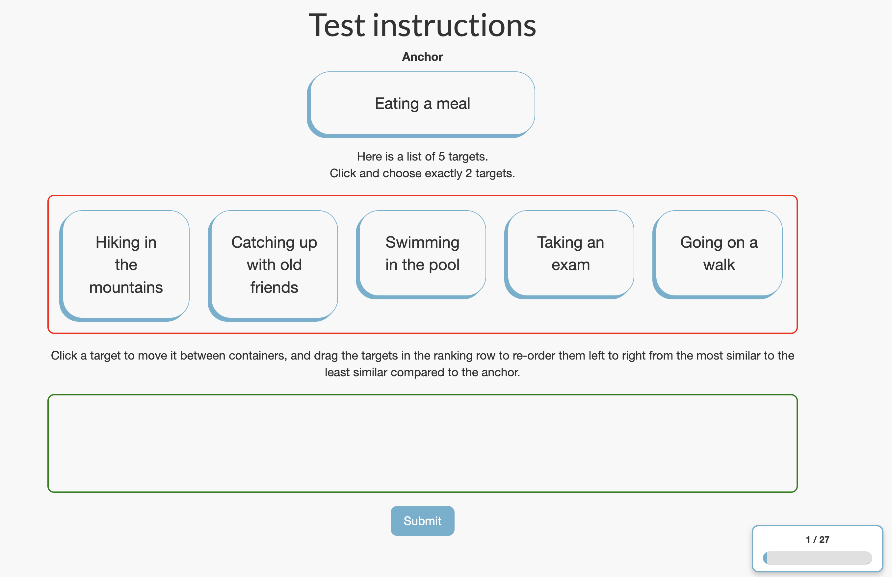
  - The red box displays the full pool of items. 
  - The green box is where the $B$ items that a participant intends to rank are placed.
  - Clicking on an item in the red box transfers it to the green box, while clicking on an item in the green box returns it to the red box.
  - To arrange the items, simply drag and drop them within the green box.
  - A participant can only submit their response when exactly $B$ items are in the green box.
  - Exception: on trap questions (see below), participants may move **one or more** of the option cards into the green box — moving just their chosen answer is enough.
- **Dynamic Sampling Algorithm:** 
  Each query is generated dynamically by some algorithm.
  - Random Sampling: Implements a basic approach by randomly selecting $A+1$ items from all user-provided targets.
    - Users can modify the input values for $A$, $B$, and the set of items to be ranked (see template ```NEXT/local/template/ArankB-init.yaml``` for all adjustable parameters).
  - Info-Tuple Sampling: Dynamically updates an embedding based on responses received in real time and selects the tuple of items expected to yield the highest information gain as the subsequent query.
    - In addition to the configurable options mentioned above, users can adjust a range of parameters unique to Info-Tuple Sampling, including the number of burn-in iterations, total iterations, down-sampling rate, and more (see template ```NEXT/local/template/ArankB-init.yaml``` for comprehensive configuration details and explanations for each parameter).
- **Trap Question Mechanism:**
  A Rank B includes a trap question system to ensure data quality by identifying inattentive or dishonest participants.
  - **Purpose:** Trap questions are designed to catch participants who are not paying attention or are providing random responses, helping maintain the quality of collected data.
  - **Implementation:** Trap questions are stored in the target set after the regular targets. They are rendered to be **visually indistinguishable from a real query**: the attention-check instruction appears inside the same purple "Target" card that normally holds the anchor item, and the answer options appear as ordinary cards in the red box (shuffled on every load). The participant moves **one or more** option cards into the green box — just their chosen answer, or a fuller ranking, both are accepted. Users can configure frequency, tolerance thresholds, and expulsion policies.
  - **Scoring:** the answer counts as correct only if the correct option is the **first (leftmost)** card in the green box; any other cards and their order do not matter. In the target set, the first comma-separated option in `primary_description` is the correct answer and `alt_description` is the question shown in the purple card.
  - **Example:** a trap question might show "Choose the option with the word positive in it." in the purple Target card with option cards "Positive, Negativity, War, Peace" — moving "Positive" into the green box (alone, or ranked first among others) passes.
  - **Configuration:** Users can modify trap question settings including enabling/disabling traps, setting frequency, tolerance levels, and expulsion policies. See template ```NEXT/local/template/ARankB-InfoTuple.yaml``` for detailed parameter explanations and configuration options.


## Binary Sentiment Word Classification Rank One and Rank N
- **Overview:** Given $n$ words, participants need to choose the most positive word(Rank One)/ rank from most positive to most negative(Rank N).
- **Query Interface for Rank One:** 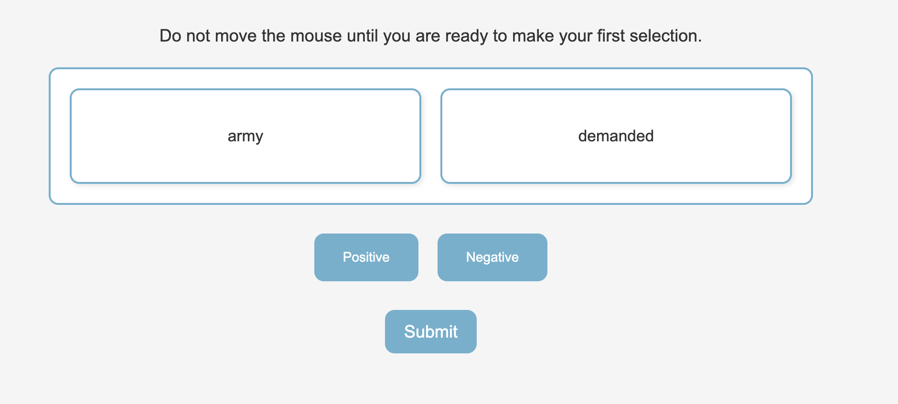 
  - The central box displays the full pool of words. 
  - Clicking on a word will highlight it to indicate choice.
- **Query Interface for Rank N:** 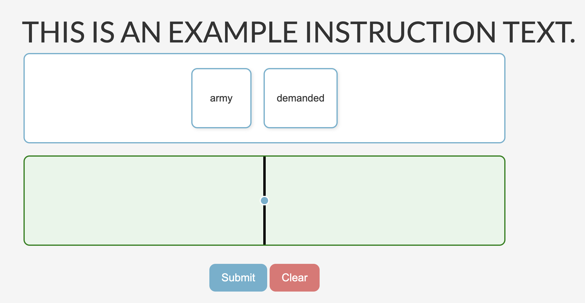 
  - The central box displays the full pool of words. 
  - Clicking on a word will highlight it to indicate choice.
  - A participant can only submit their response when exactly one word is clicked.
- **Static Sampling Algorithm:** 
  - Read CSV: Given a CSV file where each row represents the content of one query. Truncate the first *number_of_queries* rows off and naively present them as query.
    - A specific way of implementing static sampling explained previously. 


   

## PAQ (Perceptual Adjustment Query)
- **Overview:** Given a reference item and a set of target items along a perceptual continuum, participants adjust a slider to match the reference item with the most similar/dissimilar target item depending on the instruction. PAQ supports multiple media types including colors, images, text.
- **Query Interface:** 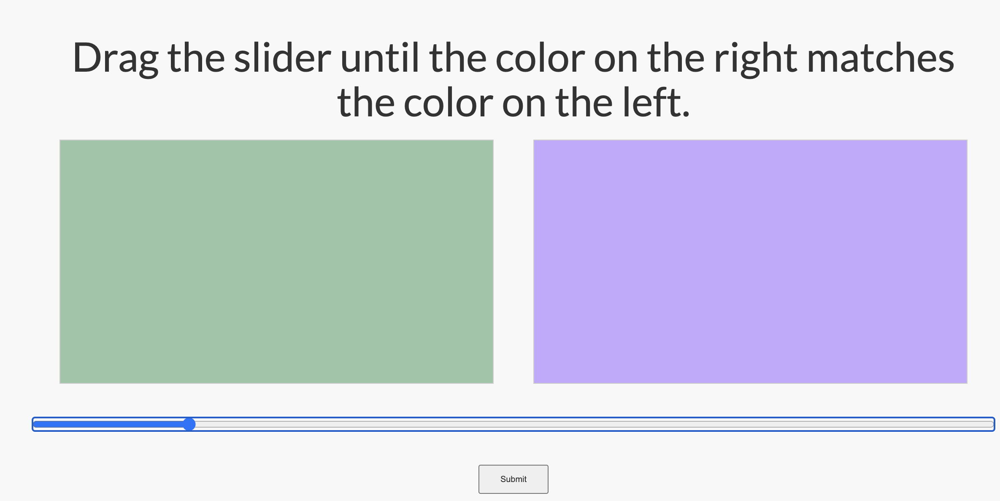
  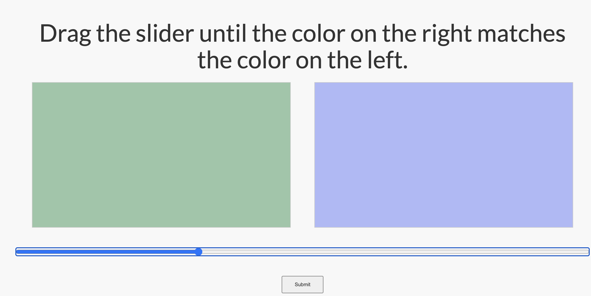
  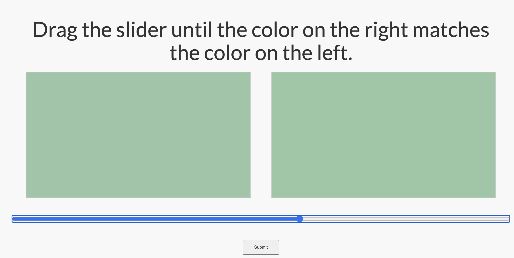
  - The left area displays the reference item (color, image, text, audio, or video)
  - The right area shows the target item that changes as participants move the slider
  - A horizontal slider allows participants to toggle and adjust the target item at some predefined range
  - The number of queries along the slider can be determined by the developer. In general, the number can be taken as 100 for color vision to ensure numerical precision accuracy
  - Participants submit their response by clicking the submit button
- **Supported Query Types:**
  - **Color PAQ:** Participants match a reference color by adjusting through a continuously changing color path
  - **Image PAQ:** Participants match a reference image by adjusting through morphed image transformations
  - **Text PAQ:** Participants match a reference text by adjusting through text variations
- **Algorithms:**
  - **ColorVision:** Generates color paths in xyY color space with directional sampling.  For more information about PAQ, see the paper: https://arxiv.org/abs/2309.04626.
    - Users can configure reference colors, directional vectors, number of ticks, and tick visibility
  - **ImageTransformation:** Creates image morphing between start and end images
    - Users can configure start, reference, and end images, number of ticks, and tick visibility
- **Dynamic Sampling Algorithm:** 
  - **DynamicPAQ:** Active learning in PAQ queries construction that dynamically selects items for each query rather than using predefined sequences
    - Randomly selects start, reference, and end items from the available target set
    - Currently supports ImageTransformation algorithm
    - **Start, Reference, and End Items:** These are the key components of a PAQ query. The start item represents the beginning of the perceptual continuum, the reference item is what participants try to match, and the end item represents the end of the continuum. For example, in a color matching task, the start item might be a blue color, the reference item could be a specific shade of purple, and the end item might be a red color. The available target set contains all possible items that can be used as start, reference, or end items in the experiment.
- **Configuration:** Users can modify parameters including reference items, directional vectors (for ColorVision), start/end items (for ImageTransformation), tick count, tick visibility, and query type (see templates ```NEXT/local/template/PAQ-ColorVision.yaml``` and ```NEXT/local/template/PAQ-ImageTransformation.yaml``` for configuration details).


   

## Pool Based Triplets(By Neuromatch)
- **Overview:** Given an item triplet. Participants need to choose one item out of two given an anchor.
- **Query Interface:** 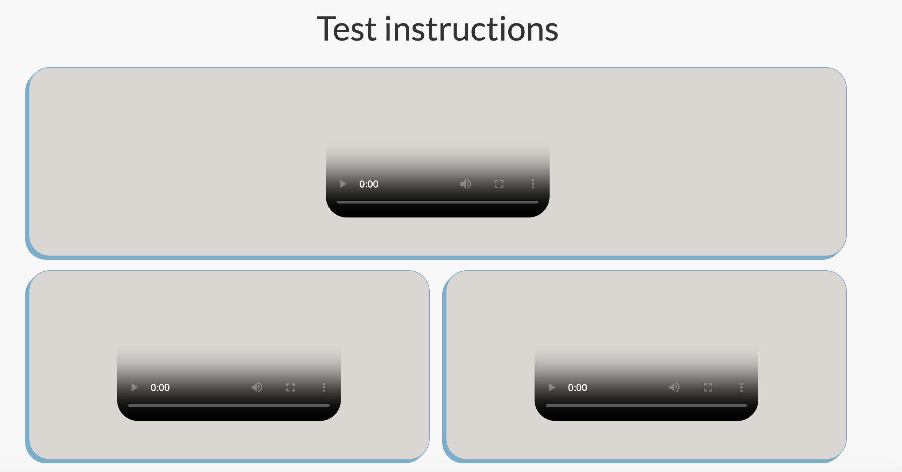 
  - The top box displays the anchor item.
  - Clicking one of the item on the bottom to suggest preference. 
  - Next query will automatically load after clicking. 
- **Sampling Algorithm:** 
  - CrowdKernel 
  - RandomSampling
  - STE
  - UncertaintySampling
  - ValidationSampling
    - User can decide what algorithms to include with what proportion. Refer to  ```NEXT/local/PBS-init.yaml``` for more details.
### 1.3. Experiment Outcomes
- **Results Overview:** All experiment-related input, whether provided by the user or generated by the system, is accessible at all times. Additionally, data such as embeddings, participant counts, and received responses can be monitored continuously, although the update frequency may vary based on the algorithm.
- **Performance Metrics:** The performance metrics available to the user include an algorithmic timing plot for each type of request, which details how long the NEXT system took to respond to a sequence of requests, as well as a histogram that presents client-side or participant-side timing data, among other information.

---

## 2. Preparation
### 2.1. AWS Instance Setup
This section describes how to set up an AWS instance to host the NEXT ML platform. Instructions for how to run the system locally can be found in the README.md of the local directory in the NEXT github repository. We assume that you have an AWS account and are familiar with computer systems, linux, SSH and the terminal.
- **Instance Type** - We suggest at minimum using an instance type of t2.2xlarge to run the NEXT system. This may need to be increased depending on the scale of your experiments. It is a good idea to monitor system performance during the experiments. This will inform you about the resources needed and can help determine the optimal instance type. You should select ubuntu 22.04 LTS as your operating system. This operating system is stable and has been tested with the NEXT implementation.
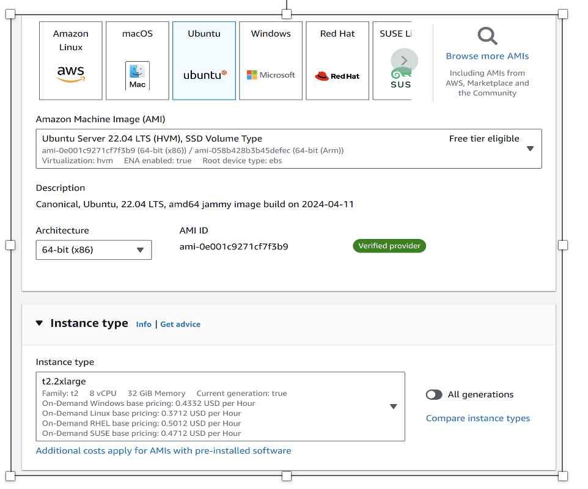 
- **Key Pair** -
In order to SSH into the system, you will need to use a pre-existing key pair that you have on AWS, or create a new one. We recommend creating a new one as a good security practice. Select create key pair and then do the following:
  - name it, i.e NEXT
  - use ed25519 (more secure)
  - select .pem as the file type and download the .pem
  - add the key file (i.e NEXT.pem) to your SSH key folder (i.e .ssh)
  - change the file permissions for the .pem file to allows access for your local user only 
    - ``` chmod 400 your_key.pem ```

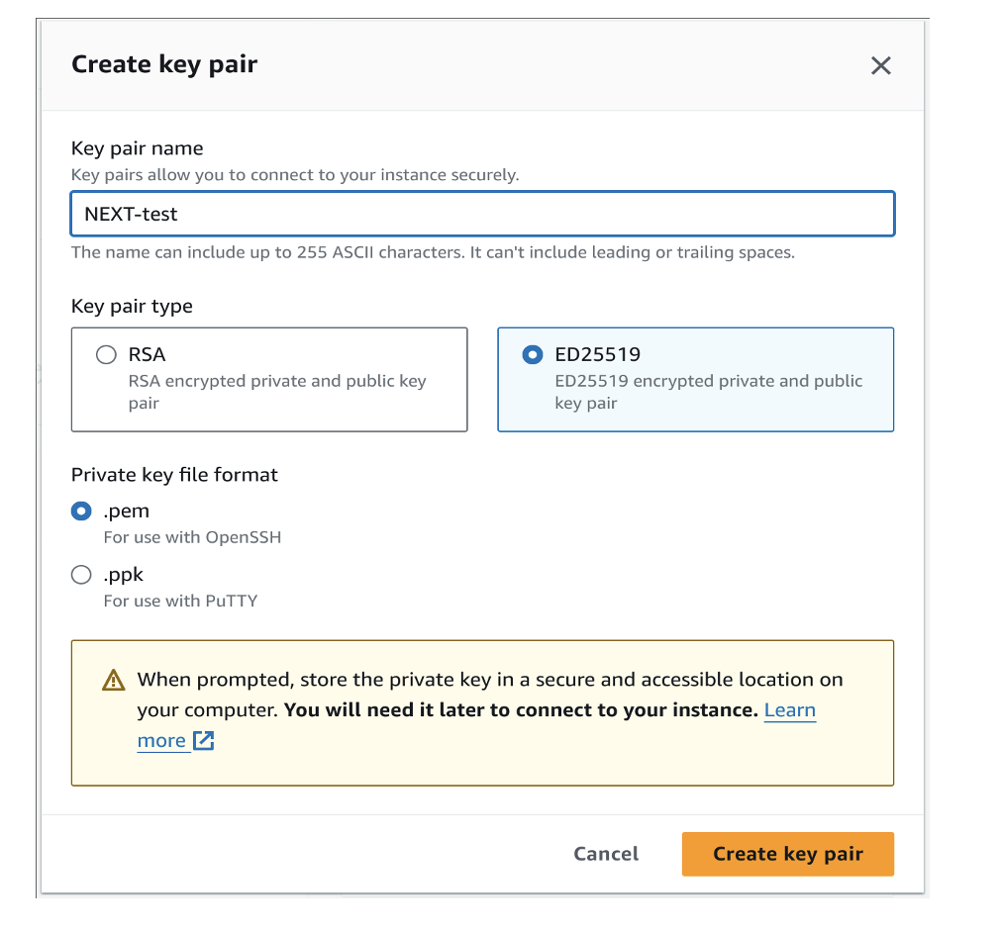 
- **Security Group** -
Since NEXT is a web facing application, you will need to create a security group to allow HTTP/HTTPS and SSH traffic to be routed to your instance. Otherwise, AWS will block requests to those standard ports. If you do not already have a group setup for this, you can create one while creating your instance. Simply:
  - allow HTTP traffic from all IP addresses
  - allow HTTPS traffic from all IP addresses
  - allow SSH traffic
    - You can restrict this traffic to be solely from your IP address (or list of addresses) to increase security of your instance.
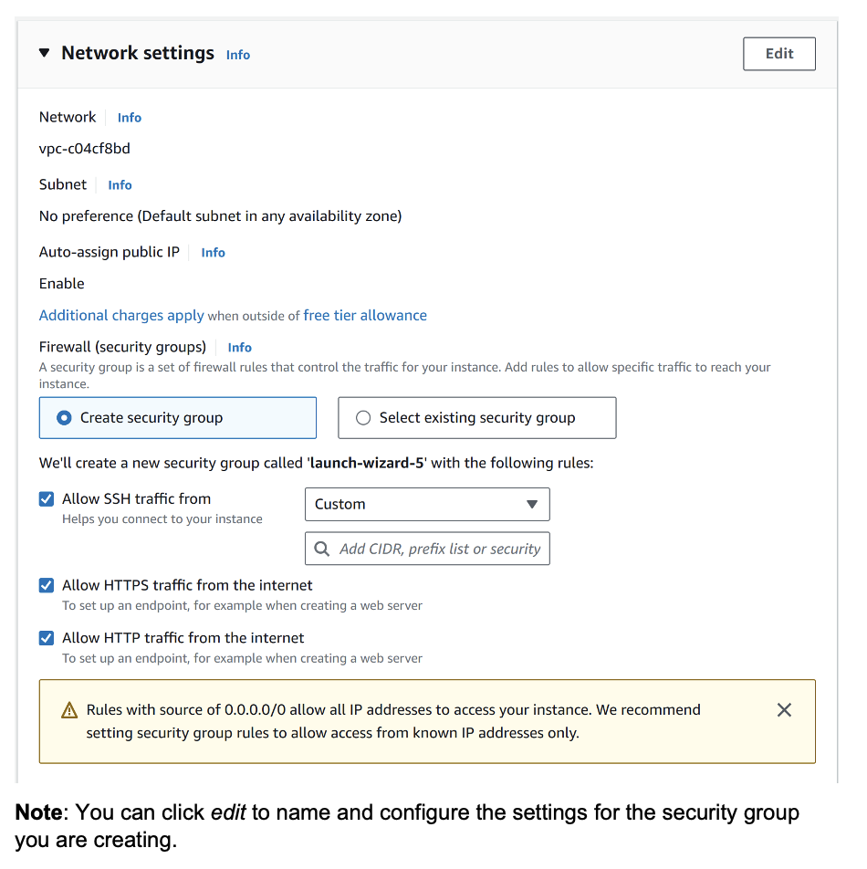 
- **Disk Space** -
To launch an AWS instance, you will need hard drive space. Select the amount of space you need. The maximum amount of free tier space should suffice for your needs. Once you finish experiments, you can always download the data and remove the Dockers and rebuild your Docker environment. This will clear old data.
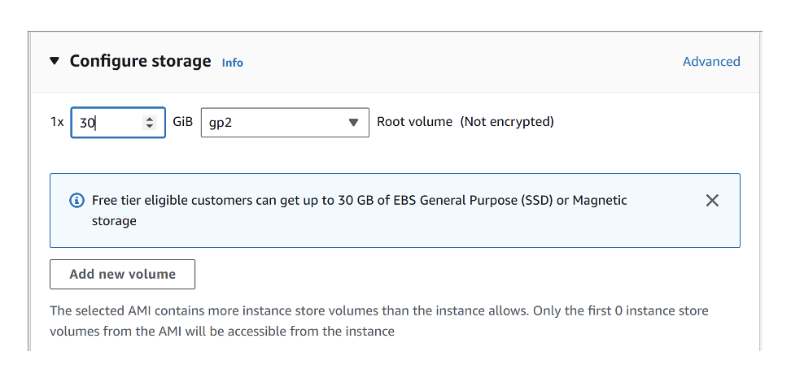 
### 2.2. Launch Instance  
Now you are ready to launch your instance. Simply click Launch instance. Wait for all the checks to pass and then you are ready to SSH into the system. Make sure to take note of the public dns address and the public ip under instance information. You will need them for SSH and nginx respectively.
Note: We have included a web server (nginx) into the Docker environment so that you do not need to set up the reverse proxy yourself. You will only need to add the ip address in the nginx.conf file before spinning up the dockers.
- **SSH** -
Once you have set up your instance (from scratch or from the AMI) and all checks have passed, you can now SSH into your system. All system configuration and experiment launching can be handled from the terminal. Make sure to use the ubuntu user and the .pem file as your identity file when SSHing in. The command will look something like this:
  - ``` ssh -i /Users/gburdell/Downloads/"students_dev.pem"  ubuntu@ec2-44-223-248-38.compute-1.amazonaws.com ```

### 2.3. Next Setup
This section describes how to set up NEXT on the newly created AWS instance. We are assuming that you are running Ubuntu, have git installed and can SSH into the system. We suggest using tmux to allow for multiple terminals within the single SSH connection and to allow for process persistence if you disconnect from your instance. Sign in to the newly created instance using SSH and continue with the next steps by entering the following commands into the terminal.

- **Clone NEXT Repo** -
You can clone the latest version of the repository by using the following command:  
  - ``` git clone https://github.com/siplab-gt/NEXT.git ```

  Once you have cloned the repository, change directory to the ```NEXT/local/``` directory and edit the ```nginx.conf``` file. You want to replace the value for server_name to the public ip address of your instance. It is currently set to next.localhost.

- **Update System and Install Latest Docker** -
The NEXT platform uses Docker to house and manage all services. You will need to make sure to have the up to date versions and the right libraries installed. To do so follow these steps:
  - Add Docker's official GPG key, run the following commands:
    - ```sudo apt-get update ```
    - ``` sudo apt-get install ca-certificates curl ```
    - ``` sudo install -m 0755 -d /etc/apt/keyrings ```
    - ``` sudo curl -fsSL https://download.docker.com/linux/ubuntu/gpg -o /etc/apt/keyrings/docker.asc ```
    - ``` sudo chmod a+r /etc/apt/keyrings/docker.asc ```
  - Add the repository to Apt sources, run the following commands: 
    ``` 
    echo \
    "deb [arch=$(dpkg --print-architecture) signed-by=/etc/apt/keyrings/docker.asc] https://download.docker.com/linux/ubuntu \
    $(. /etc/os-release && echo "$VERSION_CODENAME") stable" | \
    sudo tee /etc/apt/sources.list.d/docker.list > /dev/null 
    ```
  - Install latest version of Docker and buildx, run this command:
    - ``` sudo apt-get update ```
    - ``` sudo apt-get install docker-ce docker-ce-cli containerd.io docker-buildx-plugin docker-compose-plugin ```
  - Add ubuntu user to the docker group, run:
    - ``` sudo usermod -aG docker ubuntu ```
  - Restart docker, run:
    - ``` sudo systemctl restart docker ```
  - Verify installation, run:
    - ``` sudo docker run hello-world ```
   
- **Python Environment Setup** -
In order to launch experiments from the terminal, you will need to have a Python environment setup with the required dependencies installed. Install Python virtual-env with:
  - ```sudo apt update ```
  - ```sudo add-apt-repository ppa:deadsnakes/ppa```
  - ```sudo apt update```
  - ```sudo apt install python3.12-full```
  - ``` sudo apt install python3.12-venv ``` 
  
  Now you can create virtual environments to install Python packages. Cd into the ``` NEXT/local/``` and run the following:
  - ``` python3 -m venv local-venv ```
  - ``` source local-venv/bin/activate ```
  - ``` pip install -r requirements.txt ```
You now have created and activated a Python environment named local-venv. You have also installed all the dependencies needed to launch experiments from the terminal and even run stress tests.

---

## 3. Run Experiment
### 3.1. Experiment Config
- **Configuration File:** Navigate to ```Next/local/template```. There should be one copy of yaml file corresponding to each query type. Follow for more instructions in  the template. Please do not remove entry as it may cause error when the experiment launches. 
- **One-step-ahead precompute (A Rank B + InfoTuple):** adding `precompute: true` to the experiment config makes the platform compute each participant's *next* query in the background while they answer the current one, so the ~seconds-long InfoTuple selection overlaps with their thinking time instead of blocking the page. It is **off by default**, applies per experiment at launch, and changes nothing about the anchor schedule or the collected data — if a background result is not ready in time, the query is computed on the spot exactly as before. Rule of thumb: a participant who spends longer answering than one selection takes to compute sees the next query instantly. See `PRECOMPUTE_REPORT.md` for the design, verification, and a 30-participant load test with sizing guidance.

### 3.2. Execution
- **Launch Experiment** 
  - Copy and paste your customized yaml file to ```Next/local ```
  - Run ```docker-compose --version ```. If this command is not found, run:
    ``` 
    sudo curl -L "https://github.com/docker/compose/releases/download/1.29.2/docker-compose-$(uname -s)-$(uname -m)" -o /usr/local/bin/docker-compose 
    ```
    ```
    sudo chmod +x /usr/local/bin/docker-compose
    ```

  - Under the same directory, run ```./docker_up.sh``` to start the NEXT application. Now, you should be able to access the platform via 
  ```Instance_IP_address/home ```
  - Note that you may run into some permission error sometimes due to group membership not getting updated immediately and user may not have permission to access docker's Unix Socket. 
  - Run ```grep docker /etc/group``` and you should see some output similar to ```docker:x:999:ubuntu```.
  - Run ```newgrp docker``` to force group membership update and run ```id -nG```. 
  - Make sure you see  ```docker``` within the list of output. Then running ```./docker_up.sh``` should work.
  - **Troubleshooting: `KeyError: 'ContainerConfig'` during startup.** docker-compose v1 has a known bug on Docker Engine 25+ that fires whenever it tries to *recreate* an existing container whose configuration changed — which happens routinely after new git commits (the worker's `GIT_HASH` env changes) or when you start with a different host/IP (the backend's env changes). The failed recreate can also leave a stranded container with a hash-prefixed name (e.g. `5df8..._local_minionworker_1`). Fix: delete only the **stateless** containers and start again —
    ```
    docker rm -f local_nextbackenddocker_1 local_minionworker_1
    ./docker_up.sh YOUR_PUBLIC_IP
    ```
    (also `docker rm -f` any hash-prefixed leftover shown by `docker ps -a`). Freshly *created* containers don't trigger the bug; only recreation does. **Never `docker rm` the `local_mongodb_1` container** — unlike the backend/worker it owns the anonymous data volume, and removing it orphans your database (see §4.2 and §5). If compose ever insists on recreating `mongodb` itself, stop and take a backup first (§5.3).
  - Next, run ```source local-venv/bin/activate``` to activate a python virtual env.
  - Finally, you can launch the experiment with:
  ```python launch.py NAME_OF_YAML_FILE_YOU_CONFIGURED```. And to make sure the experiment has successfully launched, go to the home page of NEXT and find ***Experiment List***. Click it and you should be able to find the experiment you just launched by looking at the ***start date***. 
  - Click on the experiment(its ID will look something like ```e7b915a9032b1948750ae5a1a45f47```), you will be redirected to the experiment dashboard page. Under ***Experiment info***, you can find the link to open up a query page. Share this link with your experiment participants. 


### 3.3. Monitoring and Logging
- **Monitor Data Collected/Metrics Computed in Real Time** 
  - At the same dashboard page, you can spot ***Experiment data*** that contains all the experiment-related information including number of participants, number of reported answers, application ID, experiment unique ID, embedding(assuming dynamic sampling algorithms are applied), etc. Note: the participant count is the number of **distinct entered IDs** — a participant who refreshes and re-enters the same ID does not create a second participant.
- **Download Participant Data**
  - At the same dashboard page, you can spot ***Participant data*** that contains all the participant-related information including participant ID, response, decision_time, etc (actual content depends on types of query). You can download it in JSON or in CSV format.
  - **A Rank B CSV column key:** one row per answered query with `participant_uid` (the entered Prolific ID, prefixed by the experiment UID), `anchor`/`anchor_id` (the anchor item), `rank_1..rank_B` with matching `rank_k_id` columns (the participant's ranking, left to right), `target_position_k`/`position_k_id` (what was displayed), `isTrap`, `query_id`, and timing fields (`response_time`, timestamps). Trap rows intentionally have blank ranking columns (their raw answer is a sentinel, not a real ranking). Queries that were served but never answered (e.g. abandoned by a page refresh) are excluded from the CSV but remain in the JSON without a `target_winner` field.
  - **Trap outcome columns:** every answered row carries `trapped` (for a trap row: `True` means the participant answered it *wrong*; always `False` on normal rows) and `num_trapped_so_far` (the participant's running count of wrong traps at that point). Four participant-level columns are repeated on every row: `participant_num_trapped`, `participant_failed_final`, `participant_traps_seen`, and `participant_traps_answered`. The JSON download has the same aggregates under a top-level `participant_summaries` key (per participant: `num_trapped`, `participant_failed`, `num_answers`, `traps_seen`, `traps_answered`) alongside the unchanged `participant_responses`. The aggregate columns populate for experiments collected before this feature too; the per-row `trapped` field exists only for data collected after it. One nuance: if a participant is **expelled** on their final wrong trap, that last trap's outcome appears only in the aggregates (the expulsion interrupts the write to the query document).
  - **Download URLs:** the dashboard links use `/api/experiment/<EXP_UID>/participants?zip=1` (JSON) and `?csv=1&zip=1` (CSV). `?csv=1` without `zip` returns the raw CSV body directly.
- **Tips on Customize Static Sampling Process with Example** 
  - In  ```Next/local/csv ``` folder, a example CSV file is provided as well as other simple python scripts that are used to extract information from the CSV file.
  It serves as an example of how you could transform each query from your source of file to dictionary format in ```*-init.yaml```. Files in this folder extract queries and initialize a Binary Word Sentinement Classification task introduced in section one. Set configs in ```config.yaml``` and launch experiment by running ```python easy_launch.py ```.
- **Monitor System Performance**
  - It is always a good idea to monitor and test system performance. This can inform you about the needs of your system and about which processes or services are consuming resources. 
    - **Cadvisor** allows you to monitor cpu, memory, and disk usage on the system wide level, as well as per process and per container. We have implemented a password protected version for you. The default user and password is admin and password. To change these, simply change the content in the ```cadvisor_user.txt``` and ```cadvisor_password.txt``` files respectively. The docker environment will use these to set the username and password for cadvisor. To sign into cadvisor, go to this url: ``` instance-public-ipaddress/cadvisor ```

### 3.4. Linking Participants to Prolific / Qualtrics IDs
- Before the first query, every participant is shown a popup asking for their **Prolific ID**. The entered ID becomes their `participant_uid`, so it appears on every response row in the downloaded JSON/CSV participant data (see 3.3).
- The popup is **pre-filled automatically** when the query page URL carries a `participant` parameter:
  ```
  http://InstanceIPAddress/query/query_page/query_page/EXP_UID?participant=PROLIFIC_ID
  ```
- Recommended funnel setup (Prolific → Qualtrics → NEXT):
  - Set the Prolific study URL to your Qualtrics survey with the ID appended: ```https://your-qualtrics-survey-url?PROLIFIC_PID={}```
  - In the Qualtrics Survey Flow, add an **Embedded Data** element named ```PROLIFIC_PID``` (its value is taken from the URL parameter automatically).
  - Set the Qualtrics End-of-Survey redirect to: ```http://InstanceIPAddress/query/query_page/query_page/EXP_UID?participant=${e://Field/PROLIFIC_PID}```
  - If the parameter is ever missing, the popup simply shows an empty box and the participant types their ID by hand — nothing breaks.
- **Analysis note:** the exported `participant_uid` is prefixed with the experiment UID (i.e. `EXPUID_PROLIFICID`). Strip the prefix (or match by suffix) when joining against Qualtrics/Prolific records.
- **Refresh behavior:** if a participant accidentally refreshes mid-session, re-entering the same ID (pre-filled automatically when the URL parameter is present) resumes their progress — a refresh costs **zero** queries: all prior answers are kept, and the unanswered query that was on screen is re-served at the same position, so the participant still answers the full configured number of queries. A participant who reloads the page after finishing is taken directly to the completion (debrief) screen instead of being served extra queries.
- Only the main query page (`/query/query_page/query_page/...`) has this feature. Do not send participants to `query_page_popup`.

### 3.5. Completion codes and what participants see when something goes wrong
The query page has **three** exits, each with its own text and link in the experiment YAML, so a Prolific submission code tells you exactly what happened:

| Exit | When | YAML text / link | Use a Prolific code meaning |
|---|---|---|---|
| Success | all `num_tries` queries answered | `debrief` / `debrief_link` | completed |
| Attention-check failure | the participant missed enough trap questions to be expelled (`tolerance × num_trap_questions`) | `debrief_fail` / `debrief_link_fail` | failed attention checks |
| Technical problem | the server could not be reached after `retry_attempts` automatic retries | `debrief_error` / `debrief_link_error` | technical issue (**do not** reuse the failure code) |

- A failed server call (timeout, 5xx, nginx error page) is **never** shown as an attention-check failure. The page shows a "Connection problem — retrying in N s (attempt k of `retry_attempts`)" banner with a *Retry now* button and retries on its own with growing delays (5, 15, 30 s). Progress is kept on the server, so a participant who lands on the technical exit can re-open their link later and continue where they left off.
- An interrupted answer is never re-sent: recovery re-requests the query, and the server re-serves the one that was on screen (or the next one if the answer did get through), so nothing is double-counted.
- Create three completion codes on Prolific and put them in the gitignored `*_live.yaml` copy of your config (`local/prolific_codes.local.txt` is the local record). Review a "technical issue" submission by checking the participant's progress in the export rather than treating it as a failure.

---

## 4. End Experiment & Shutdown server
### 4.1. Retire/Unretire an Experiment
  - At the experiment list page on NEXT 
  ```http://InstanceIPAddress/dashboard/experiment_list```, check the correct experiment and click "retire" or "unretire".

### 4.2. Shutdown the application
  - Go to ```Next/local ```.
  - Run ``` docker-compose stop ``` to stop all the running containers.
  - **WARNING — never run `docker-compose down` and never run `docker volume prune`.** The MongoDB data lives in an *anonymous* Docker volume: `down` deletes the containers and orphans that volume, so the next `./docker_up.sh` starts with an **empty database** while your old data sits stranded in a dangling volume (this has happened on this instance — see 5.5 for recovery). `./docker_up.sh` itself uses `stop` + `up`, which is safe.
  - Always use `docker-compose` (v1, with the hyphen), not `docker compose` (v2). v2 uses a different project naming scheme, attaches fresh empty volumes, and the database will silently appear empty.
### 4.3. Shutdown Amazon EC2 instance
  - Go to ```EC2 > Instances ``` webpage.
  - Check the current instance in the list.
  - Find the ```Instance state ``` radio button on the top and choose Stop instance.

## 5. Data Management: Backup, Cleanup, and Recovery

### 5.1. Where the data lives
- All experiment data is in MongoDB inside the `local_mongodb_1` container (MongoDB 7.0 — use ```mongosh```; the legacy ```mongo``` shell does not exist in this image).
- Database ```app_data```: per-app collections (e.g. ```ARankB:queries``` — one document per query including the answer and `participant_uid`, ```ARankB:participants```, ```ARankB:experiments```, ```ARankB:algorithms``` — algorithm/model state, ```ARankB:dashboard```, ```ARankB:other```), plus the global ```experiments_admin``` (experiment index) and ```targets``` (target sets, re-inserted on every launch).
- Database ```logs```: ```<app>:APP-EXCEPTION```, ```<app>:ALG-DURATION```, ```<app>:ALG-EVALUATION``` (these grow fastest).
- The database files live in an anonymous Docker volume mounted at ```/data/db```. Redis and RabbitMQ hold only transient task state, and ```local/media/``` is static files — neither ever needs cleaning.

### 5.2. Inspecting the database
```
# collection counts and sizes
docker exec local_mongodb_1 mongosh app_data --quiet --eval 'db.getCollectionNames().forEach(c=>print(c, db[c].countDocuments({}), (db[c].stats().storageSize/1048576).toFixed(1)+"MB"))'
# list experiments, newest first
docker exec local_mongodb_1 mongosh app_data --quiet --eval 'db.experiments_admin.find({},{exp_uid:1,app_id:1,start_date:1}).sort({start_date:-1}).forEach(printjson)'
```

### 5.3. Backup (always do this before any cleanup)
The dashboard's database "Download" button and the S3 backup scripts are broken legacy code — do not rely on them. The reliable route (the dump lands on the host at ```NEXT/local/backup_YYYY-MM-DD/```):
```
docker exec local_mongodb_1 mongodump --host 127.0.0.1 --port 27017 --out /next_backend/local/backup_$(date +%F)
```
Per-experiment participant data can also always be downloaded from the dashboard as JSON/CSV (see 3.3).

### 5.4. Cleanup between data collections
There is no working delete function in the app ("retire" only hides an experiment from the dashboard — the data stays). Cleaning is manual:
```
# delete ONE experiment's data (set the app name and experiment UID first)
docker exec local_mongodb_1 mongosh app_data --quiet --eval '
 var a="ARankB", u="EXP_UID_HERE";
 ["queries","participants","experiments","algorithms","dashboard","other"].forEach(function(c){
   printjson({coll:a+":"+c, deleted: db[a+":"+c].deleteMany({exp_uid:u}).deletedCount});});
 printjson({targets: db.targets.deleteMany({exp_uid:u}).deletedCount});
 printjson({admin: db.experiments_admin.deleteMany({exp_uid:u}).deletedCount});'
docker exec local_mongodb_1 mongosh logs --quiet --eval '
 var a="ARankB", u="EXP_UID_HERE";
 ["APP-EXCEPTION","ALG-DURATION","ALG-EVALUATION"].forEach(function(c){
   printjson({coll:a+":"+c, deleted: db[a+":"+c].deleteMany({exp_uid:u}).deletedCount});});'

# OR: full reset (wipes ALL experiments in both databases)
docker exec local_mongodb_1 mongosh --quiet --eval 'db.getSiblingDB("app_data").dropDatabase(); db.getSiblingDB("logs").dropDatabase()'
```
Indexes are recreated automatically the next time an experiment is launched.

### 5.5. Recovering data from an orphaned volume
If ```docker-compose down``` was ever run (see 4.2), the previous database usually survives in a dangling volume:
```
docker volume ls -qf dangling=true                      # candidate volumes
sudo du -sh /var/lib/docker/volumes/VOLUME_HASH/_data   # a real mongo dbpath is 100s of MB
```
Recover by mounting the volume in a throwaway mongod (re-using the image the stack already built), dumping, and copying out:
```
docker run --rm -d --name mongo_recovery -v VOLUME_HASH:/data/db local_mongodb:latest mongod
docker exec mongo_recovery mongodump --out /tmp/recovered
docker cp mongo_recovery:/tmp/recovered ./recovered_dump
docker stop mongo_recovery    # container auto-removes; the volume itself is untouched
```
Then ```mongorestore``` the dump into the live database if desired. As of Aug 2026 this instance has one such orphaned volume (~441 MB, data from Oct 2025–Mar 2026) — do not prune it.

## 6. Link to Media Instructions
``` https://mediaspace.gatech.edu/media/NEXT_install_instructions_part_1/1_p9fujklo ```
``` https://mediaspace.gatech.edu/media/NEXT_install_instructions_part_2/1_ucyud9f3```
